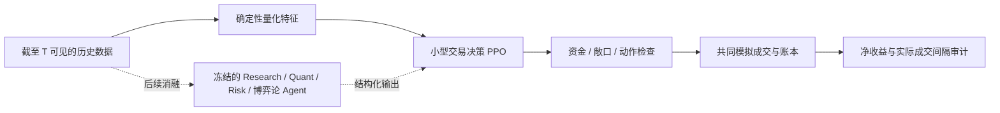

# 交易决策 RL 下一轮设计

后续用户已取消最低交易频次，当前方法见[费用变量与净收益 PPO](allocation_profit_fee.md)。本页的周频目标与惩罚规划仅作历史记录，不再约束新实验。

2026-09-20。**本页保留最初设计稿，创建时尚未实现或启动本轮训练。** 配套的 [JSON 实验计划](../configs/allocation_rl_experiment_plan_v1.json) 是规划规格，不是现有 `trading_rl run` 可执行配置。已有结果见 [首轮 PPO 报告](allocation_ppo.md)。

最新进度：已按独立[可执行配置](../configs/allocation_ppo_execution_retrain_v1.json)完成六次配对重训和 66 组训练内回放，见[重训报告](allocation_ppo_execution_retrain.md)。训练时长改为与决策周期一致的 1 小时，4 小时仅作迁移检查；未新增或打开开发/测试数据。本轮减少了成本损耗，但两组均未实现全部种子周频达标或主成本盈利。下面的原设计与尚未满足的新开发集条件保留。

同日进度补记：下述第一步的[训练分区成交诊断](allocation_cadence_diagnostic.md)已完成，五组冻结策略均存在周频超期。原计划保留；奖励实现与新训练尚未开始。训练侧发现促使下一步先核验共同执行环境的订单有效期、覆盖和人工范围边界，详见诊断报告的后续顺序。

后续进度：[执行有效期核验](allocation_execution_lifetime.md)已完成 45 组回放。1 小时和 4 小时的冻结 PPO 达到训练内周频要求，但主成本亏损加重，暴露了大量缺少成本后优势的自主交易。下述 JSON 保留为原设计稿，不直接启动；新的训练设计需要固定共同执行协议，优先重学成本后的选单和退出，不能把仅增加周频惩罚当作已经验证的改进。

## 证据与问题

首轮证明了优化器确实更新参数，并且三个种子都比各自初始化策略少亏；还没有证明 RL 能提高系统的可用收益。

| 主成本情景，初始 $100 | 平均期末现金 | 每 7 天实际成交达标 |
| --- | ---: | --- |
| 固定均值回归 | $96.430695 | 是 |
| PPO，三个预设种子 | $96.525540 | 0 / 3 |

平均差额只有 **+$0.094845**。不能把相对弱初始化的改善当作超越固定策略，也不能挑出 $97.60 的最好种子作结论。验证集已被多轮开发查看，训练集只有 6 个独立事件组，重复小时数和重复训练不能补足独立样本。

本轮只检验一个假设：**将实际成交超期的成本加入策略训练，是否比单纯限制临近期限的动作，更有助于满足周频要求，同时控制净损失？** 盈利仍须单独检验；修复周频不等于产生预测优势。

## 系统职责



- **本轮学习范围**：是否参与、选哪个候选、Yes / No、$1 / $2 预算、部分或全部退出。沿用 25 个动作、88 项观测和现有候选排序。
- **共同执行层**：所有对照使用同一套资金约束、候选集合、提前尝试、成交失败处理与退出规则。共同规则带来的改善不归因于 RL。
- **Qwen 与多 Agent**：本轮保持冻结，仍只用量化特征。后续单独测试 Agent 信息是否提供额外价值，再决定哪些能力需要 LoRA。
- **预测任务**：事件概率用 Brier / Log Loss / ECE 检验；均值回归价格目标不当作事件概率。交易 PnL 奖励不回传到预测模型。

## 奖励、约束和记账

保留资金余额不为负、单事件组成本敞口不超过 $5、总成本敞口不超过 $20、最多 4 个持仓等现有硬检查；当前单笔和槽位限制还会进一步限制实际资金使用。

基础奖励仍为 `r_pnl = E_after - E_before`，其中 `E` 是计入现有假设费用后的清算价值近似。手续费与滑点已经进入账本，不再另扣一次。保留独立的美元奖励序列，使整段未折扣奖励仍可复算为最终净收益。日历期末权益与日历结束后的最终现金分别报告。

新增一个成本通道 `c_late_hours`：在当前转移覆盖的时间内，账户已经超过上次实际成交后 168 小时的**新增超期时长**。按精确成交时间切段计算，不按每个决策点取整，也不在每一步重复收取累计超期时长。只有模拟买入或卖出成交重置计时；下单、撤单、失败重试和结算回款均不重置。

如果一段没有成交的区间从 `a` 到 `b`，其之前的计时锚点为 `L`，该段贡献为：

```text
late_hours(a, b, L) = max(0, b - max(a, L + 168 hours)) / 1 hour
```

在转移内部每笔实际成交处切段，并将 `L` 更新为该成交时间；无成交开局以预先固定的回放起点为锚点。统计覆盖开局到首次成交、相邻成交以及最后成交到固定回放终点的区间。回放终点后的平仓或结算不能补救期内违约。训练 rollout 分段不能重置账户的周频计时。

第一轮采用一个固定、可审计的惩罚尺度：

```text
对照：r_train = r_pnl
候选：r_train = r_pnl - 0.10 USD/hour * c_late_hours
```

`0.10` 是预先提出的工程起点，含义是累计超期 10 小时扣除 $1 的训练奖励，尚未证明最优。它**不扣账户现金**，也不算真实交易损失。分别保存 `pnl_reward_usd`、`late_hours`、`cadence_penalty_usd`、`training_reward`，校验奖励恒等式；不奖励成交次数，不添加持仓时长奖励。本轮不搜索多个惩罚权重。

这是 PPO 的奖励消融，**不是具有严格可行性保证的约束求解器**。官方 [Maskable PPO 文档](https://sb3-contrib.readthedocs.io/en/master/modules/ppo_mask.html)描述的是动作屏蔽；我们的成交间隔是跨时间的轨迹要求，屏蔽单个动作不足以证明达标。奖励和约束分开定义的研究依据可参见 [Constrained Policy Optimization](https://proceedings.mlr.press/v70/achiam17a.html)，但这里没有实现 CPO，也不声称继承其理论保证。

验收仍要求所有区间不超过 604,800 秒。惩罚后的训练回报再高，只要有实际成交超期，就判不合格。市场或当前准入范围没有可执行机会时保留失败记录；不能通过加大惩罚制造流动性。

沿用 `gamma=0.995` 以隔离这一次奖励变化。其训练目标是折扣回报，不等于最大化整段未折扣期末现金；奖励账本的累加恒等式不能证明两者等价。暂不同时修改折扣、持仓上限或信号阈值。

## 先做训练分区诊断

在再次评测之前，先产出训练分区的逐时诊断：距期限多久、全准入范围与 4 个候选槽位各有多少合法动作、报价年龄、现金及敞口、退出请求、后续首次成交是否落在 300 秒窗口内、取消原因。

1. 区分候选截断、规则限制、现金或持仓限制，以及缺少后续成交参考等失败原因。没有观察到成交参考不等于证明整个市场没有流动性。
2. 后续成交时间只由模拟执行器和事后诊断使用，不进入当时的政策观测。未来价格、结算标签、完整未来成交密度不得进入候选排序。
3. 不凭一次失败回放宣称“不存在可行策略”。可以报告该轨迹受何种限制，但历史全知的机会分析不是可部署政策，也不得用于剔除不利时段。
4. 检查候选生命周期、到期时间等特征的来源。数据集人工回放边界与合约在当时公开的期限分开标记；不能把未来数据覆盖范围误称为事前市场知识。
5. 若需要修改提前尝试时间、候选排序或执行规则，先形成一个新的共同环境版本并冻结，再让全部对照重跑，不能只给 RL 改善执行条件。

起草时该诊断尚待实现；现已完成，结果见开头的进度补记。现有训练数据可用于功能核验；正式收益结论需要补充独立事件、报价质量和新开发时段。

## 最小公平对照

| 对照 | 输入与执行 | 训练奖励 | 用途 |
| --- | --- | --- | --- |
| 固定均值回归 | 共同环境 | 无训练 | 主要可行策略参照 |
| 仅周频成本选择 | 共同环境 | 无训练 | 参与要求的成本诊断，失败仍报告 |
| PPO 对照 | 现有量化特征、共同环境 | 净权益变化 | 排除重训、环境版本的影响 |
| PPO 周频候选 | 与 PPO 对照相同 | 净权益变化减超期惩罚 | 单独检验周频训练成本 |

两个 PPO 组都从相同种子对应的同一初始化参数开始，各训练 **32,768 步**，使用种子 **7 / 17 / 27**，主种子 **7**。总计 6 次训练、196,608 个环境步；其余超参数、依赖与三档成本继承绑定哈希的 v1 配置。训练用主成本，评价报告无成本、主成本、压力成本，不挑成本情景。

固定步数的最后检查点以及初始化检查点全部保存，所有种子完成冻结后才运行新的开发评估。报告全部种子与配对差额；种子标准差表示优化波动，不当作事件泛化的置信区间。必要的功能测试使用人工行情，不用于收益结论。

## 数据与评估边界

- 现有训练：25 个合约、6 个独立事件组；只能支持小规模诊断。新增训练数据也须有历史规则、结算证明、来源时间与事件分组。
- 现有 55 个验证合约：作为已观察的开发历史，禁止改为训练数据；如重放只报告回归检查，不能重新命名为未见测试。
- **新开发数据清单尚未冻结**。先按时间和事件组划分、跨数据集去重、校验时间证据，再冻结清单哈希、成本假设、完整数值配置和代码。数据选择不能依据策略盈亏。
- 最终测试继续封存。新增数据不得与其事件或近重复合约重合，按已有分区元数据检查，不能为排重而打开测试结算标签。
- 仍只有成交记录、缺真实双侧盘口与深度时，结果只能称“历史成交参考价下的模拟”。未来补齐报价、费用与最小交易量后，需要共同执行环境的独立验证。

尚未具备新开发清单和新奖励实现，因此本文件不是已经冻结的正式实验注册。后续若依据训练诊断修改计划，要保留版本差异、修改原因及当时已查看的数据；任何新开发结果出现后都不能悄悄重写原计划。

## 通过标准与后续路径

第一阶段问“周频约束是否有改善”：记录违约次数、总超期小时、最长成交间隔、成交取消与自动退出次数，同时报告净 PnL、回撤、费用、资金使用及强制参与归因。净 PnL 小幅提高但仍超期，不算满足用户要求。

盈利候选进入下一阶段的必要条件为：所有预设种子在主成本下零周频违约、零资金/敞口违规，平均净收益为正且超过相同环境的固定均值回归，并完整呈现最差种子、分时段与压力成本结果。仅满足这些条件仍不足以自动晋级；需要更多独立事件及未参与调整的时间段复现，不能凭一次小回放宣布稳定盈利。

实现与核验顺序：

1. 训练分区可成交机会与周频失败诊断。
2. 新增精确超期成本、四项奖励日志及单元测试：168 小时边界、跨步成交、同一步多笔成交、无成交、撤单/结算、期末区间与奖励复算。
3. 人工行情验证“因惩罚改变动作”不会伪造成交，也不会修改现金账本；保留未来信息隔离、实际 PPO 更新及冻结权重重放检查。
4. 补充并冻结新开发数据与运行配置，完成上述四组对照。数据未就绪时止于训练侧机制诊断，不发布新的泛化收益结论。
5. 有可靠交易基线后，单独比较量化特征与加入冻结 Agent 输出的效果。只有发现具体能力缺口，再对相应能力做 SFT / LoRA 或预测 RL；不同时改 Agent、预测模型、策略与执行器。

设计与规划规格保留，诊断、执行核验及训练内机制对照的最新进度见文首链接。新开发集验收尚未进行，默认策略未变，最终测试仍封存。
