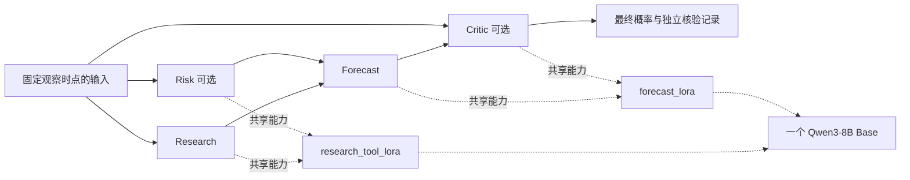

# 多 Agent、能力 LoRA 与分阶段 RL

目标是在单张 RTX 3090 上，用同一个 `Qwen/Qwen3-8B-Base` 基座组织不同工作流程，并通过独立评估验证系统增益。角色划分、参数适配和强化学习是三个可以分别消融的维度；增加角色或适配器本身不代表预测更准确。

## 首版能力与角色

配置：[capability_agents_v1.json](../configs/capability_agents_v1.json)。基座固定到 `49e3418fbbbca6ecbdf9608b4d22e5a407081db4`；两个适配器共用 r=16、alpha=32、dropout=0.05 和七类投影模块。

| 能力适配器 | 使用角色 | 目标 |
| --- | --- | --- |
| `research_tool_lora` | Research、Quant、Risk | 时间约束、证据选择、反证、工具调用 |
| `forecast_lora` | Forecast、Critic | 概率估计、不确定性、检查和修正预测 |

能力配置仍标记为 `planned`，它表示架构计划，不是 checkpoint 晋级注册表。`research_tool_lora` 已完成三版候选训练与评估：首版的流程回归已通过新提示修复，第二版在新任务约束下退步，第三版改善了训练模板内的新数值情景判断，但跨表达方式的稳定性仍不足。三版均未晋级默认；`forecast_lora` 尚未训练，详见 [首次训练](research_tool_lora.md)、[第二版三组对照](research_tool_lora_v2.md) 与 [第三版平衡训练](research_tool_lora_v3.md)。角色通过不同提示和输出契约区分，不为每个 Agent 启动一个完整 8B 模型。Orchestrator 使用确定性的任务路由，不额外调用一个模型。



## 已实现的运行边界

`AgentRunner` 接受 `ForecastInput`，拒绝完整 `ForecastRecord`，并重新验证证据与报价时间。结果标签、结算时间和数据集身份不会进入模型输入；模型可见的是问题、观察时间、事前证据和可选市场快照。调用方仍须先完成来源真实性及历史规则审核，runner 不会把暂存样本自动升级为合格数据。

首版支持 `single_forecast`、`research_forecast`、`reviewed_forecast`、`research`、`risk`、`calculate` 六种工作流程。`base` 模式明确禁用适配器，用于对照实验；`capability` 模式要求后端具备所请求的适配器，缺失时直接失败，不能悄悄退回基座。

部分能力实验可以显式传入 `capability_scope={"research_tool_lora"}`：只有该能力对应的角色启用适配器，其余角色明确使用 Base。该参数仅用于 `capability` 模式；不传时保持原有全能力路由，范围内请求的适配器缺失仍会失败。首个候选评估用此方式让 Research / Risk 加载候选、Forecast / Critic 使用 Base，避免混入尚未训练的预测适配器。

- Research 选择原始证据 ID，不重写证据正文。Forecast 接收选择后的证据和结构化研究/风险结果。Risk 与 Critic 仍能检查原始事前证据，避免 Research 的遗漏被整个系统隐藏。
- Forecast 输出统一的概率 JSON。Critic 接受原预测时不得同时改概率；修正时必须提供理由和有效证据引用，原预测和批评记录保留供比较。代码不自动把概率拉向 0.5。
- 校验失败最多修复一次，错误仍存在则返回明确失败和空预测。后端异常、输入超限、未知引用和缺失适配器不能产生默认 0.5。没有静默截断。
- Quant 的首版工具只有 `bayes_binary` 与 `weighted_probability`，使用确定性分数运算；不执行模型给出的 Python、shell 或任意网络请求。工具结果正确不自动证明模型选择的参数有证据支持。
- 结构化结果会限制字段、时间和引用；这些检查**不能证明自由文本结论真实、引用恰当或不存在隐性历史知识污染**。事实支持和任务效果仍需单独评估。

本地 `SharedPeftExecutor` 对“选择适配器→完整推理→恢复”整体加锁，一次只启用一个适配器。基座对照使用 `disable_adapter()`，拒绝合并后的适配器和未经验证的叠加；成功或异常后均恢复原适配器并冻结参数。所有对同一 PEFT 模型的请求须经过同一个 executor。具体接口参考 [PEFT 官方模型接口](https://huggingface.co/docs/peft/package_reference/peft_model)。

`PeftTextBackend` 已提供受限长度、无在线检索的 Base 提示渲染和生成入口。后端注入的方式允许后续接入 vLLM；vLLM 支持逐请求 LoRA 选择，见 [官方多 LoRA 文档](https://docs.vllm.ai/en/latest/features/lora/)。本次没有启动 vLLM 服务，PEFT 实测不代表 vLLM 的并发、缓存或显存表现。

扩展行为评测见 [Base 多 Agent 行为基线](agent_behavior_baseline.md)。运行器现在还支持显式的 `output_protocol="plain_json_v1"` 提示对照，以及 `response_transport="single_json_fence"` 的完整 JSON 代码块解包；默认仍严格接受纯 JSON。解包不会选择多个候选、修补字段或放宽时间与证据校验，日志会标明哪些有效回答依赖这一接口适配。概率正确性、文本得到证据支持的程度和运行成本继续单独评估。

新增可选协议 `grounded_json_v2` / `grounded_json_v3` 明确完整复制事件、区分已知参数与未知结果，v3 额外声明未知项必须是字符串数组。Forecast 修复请求只重申原输入中的事件与时间，仍由模型生成完整答案并接受原校验。默认不自动切换。三组实验为同一研究/工具能力的旧 checkpoint 注册 `research_tool_previous_lora` 别名，每次请求仍只使用一个适配器，详见 [接口实验](agent_contract_v2.md)。

## 强化学习与 SFT 的关系

实验计划：[multiagent_experiment_plan_v1.json](../configs/multiagent_experiment_plan_v1.json)，它是版本化计划，尚非可直接启动的 GRPO 训练配置。

1. 先测基座行为与预测基线，确认格式、工具和引用能力。若缺乏基础行为能力，可以使用已有独立合成集做少量预热；按项目约定，不从 raw Base 直接开启正式 RL。
2. 先分别改善 `research_tool_lora` 与 `forecast_lora`，每次只训练一个适配器，冻结基座和其他适配器。预测 RL 的首轮还需冻结上游流程，减少“输入变化还是预测能力变化”的混淆。
3. 真实事件 SFT 是可选路线。已核验的历史结果可以用于评分和 RL 奖励，无需先构造一份事前“正确概率”。历史规则、证据时间和事件切分仍是必要条件。
4. 研究/工具能力使用可验证的工具答案或经过审核的证据任务；仅检查引用 ID 存在不适合作为完整研究质量奖励。风险/校准专用 LoRA 等到角色消融证明需求后再增加。

已实现的预测奖励位于 `rewards.py`：有效输出使用 `-(p-y)^2`，非法概率或 schema 不合格时给下界 -1。没有篇幅、思考长度、PnL 或“趋向 0.5”奖励。`critic_score_delta` 只计算修正前后 Brier 奖励之差，属于离线诊断，不能单独证明 Critic 的因果贡献。

评分器在标签侧运行；rollout 只接收 `ForecastInput`。后续 RL 训练器仍需验证训练样本身份、标签可用时间、按事件组隔离及 ForecastBench 排除，不能把纯评分函数当作完整数据准入器。

普通 BF16 LoRA 在此前短训练中已通过显存测试；**GRPO 的采样、参考策略和训练阶段显存尚未测量**。不能把普通 SFT 或切换测试的显存结果当作 GRPO 已可运行的证明。本次未安装新训练框架，也未启动 RL 优化。

## 评估设计

固定同一批事件、相同观察时点和可用证据，比较：

| 实验 | 工作流程 | 权重 |
| --- | --- | --- |
| 单 Agent 基线 | Forecast | Base |
| 多 Agent 基线 | Research → Forecast | Base |
| 预测适配器 | Forecast | forecast LoRA |
| 能力分工 | Research → Forecast | 两类能力 LoRA |
| 风险与批评消融 | Research → Risk → Forecast → Critic | 同样两类能力 LoRA |

同时报告 Brier、Log Loss、ECE、覆盖率、格式/工具有效率，以及总模型调用数、总输入/输出 token、延迟和峰值显存。市场对比必须使用有相同时点合格市场报价的相同子集。除了每次调用使用相同上限，还需要在总 token 预算接近时比较，区分额外计算量与分工收益。保留 Critic 修改前后的分数，不能只挑修改有利的样本。

同一基座的角色可能共享知识缺口和相关错误，多 Agent 不是独立模型的多数投票。当前两个历史会议组不足以证明系统泛化，仍需扩充独立事件，并保留前瞻预测留档。

## 复现入口

```bash
conda activate lab

# 只查看路由，无模型调用。
PYTHONPATH=src python -m foretellmesh plan-agents \
  --workflow reviewed_forecast --mode capability

# 固定脚本回答，只测试编排与数据流；不是模型预测。
PYTHONPATH=src python -m foretellmesh check-agent-workflow \
  --output runs/capability_agent_workflow_check_next

# 真实 8B 基座 + 两个随机诊断 LoRA：保存、加载、切换、恢复。
# 附带的 Base 行为检查只读取 fixture 的 input，不读取脚本回答。
HF_HUB_OFFLINE=1 TRANSFORMERS_OFFLINE=1 PYTHONPATH=src \
python -m foretellmesh.multilora_probe \
  --model-manifest checkpoints/qwen3_8b_base_manifest.json \
  --base-agent-fixture examples/agent_workflow_fixture_v1.json \
  --output runs/qwen3_8b_multilora_switch_probe_next

PYTHONPATH=src python -m unittest discover -s tests -q
```

实际脚本流程报告：`runs/capability_agent_workflow_check_v1/report.json`。GPU 诊断权重保存在各次 probe 的 `diagnostic_adapters/` 下，仅用于验证切换，**不是训练出来的研究或预测能力适配器，不得部署为默认模型**。GPU 报告记录模型 revision、配置与源代码哈希、软件版本、显存、短序列前向延迟、输出一致性；该 token/s 是短序列前向吞吐，不能解释为自回归生成速度。

## 2026-09-18 实测

最终报告为 `runs/qwen3_8b_multilora_switch_probe_v2/report.json`，原始模型输出在同目录 `base_behavior_generations.json`。此次使用 `conda lab` 的 PyTorch 2.13.0、Transformers 5.17.0、PEFT 0.20.0、CUDA 13.0；基座 BF16，两个 FP32 r16 适配器，无量化。

- 8B 基座只加载一次；适配器保存、卸载、重新加载后，基座 embedding 的设备存储指针不变。
- 两个诊断适配器产生不同 logits；各自切回后与其保存前参考逐位一致。禁用适配器的输出与原始基座逐位一致，异常请求后适配器状态恢复，全部参数保持冻结。
- 该短上下文检查加两种 Base 行为流程的峰值分配显存为 **15.75 GiB**；短序列前向（包含切换及复制最后位置 logits 到 CPU）的中位耗时约 **0.107 秒**。不包括长期服务、训练优化器或 GRPO 多样本 rollout 的资源验证。
- 同一个公平硬币合成任务：`single_forecast` 1 次调用通过，模型调用耗时约 **3.63 秒**；`research_forecast` 3 次调用完成，约 **18.18 秒**，其中 Research 的第一次回答包含重复的后续输入文本，被严格 JSON 校验拒绝，修复一次后通过。两种流程最终概率均为 0.5。此单例不是能力基准，也不足以宣告 raw Base 已满足正式 RL 的行为准入。

CPU 回归测试共 165 项，其中 164 项通过、1 项可选 GPU 测试跳过；上述完整 8B GPU 检查另行实际执行通过。新增测试覆盖能力共享、未知适配器拒绝、结果隔离、修复次数、风险证据传递、Critic 修正规则、确定性计算、Brier 奖励和并发请求隔离。

同日后续扩展已完成三轮共 120 项行为测试与 177 项回归检查，详见 [扩展报告](agent_behavior_baseline.md)。格式适配后各预测流程均完成 12/12，但工具参数仅正确 2/4，并观察到不受输入支持的风险假设和先验遗漏。

随后完成首个 `research_tool_lora` 的合成训练与 72 项生成对照，详见 [训练与评估报告](research_tool_lora.md)。工具参数和受限证据任务改善，但完整流程从 12/12 降到 11/12，并出现将已知参数标为未知的行为；共同完成样本没有预测分数增益。候选未设为默认，RL 未启动。代码回归扩至 188 项，其中 187 项通过、1 项可选 GPU 检查跳过；完整 GPU 训练与评估另行执行。额外角色是否值得启用，仍须结合实际任务收益和调用成本判断。

继续完成了 200 项提示对照、第二版 432 条样本训练及 204 项三组对照，并离线重放全部指标。v3 提示下三组流程均为 12/12；新旧 LoRA 的预测分数相同，但第二版在证据分类和字段名诊断上退步，因此保留实验权重，不替换旧版、不晋级默认，也不进入 RL。测试扩至 202 项，201 通过、1 项可选 GPU 检查跳过。完整结果与资源记录见 [第二版报告](research_tool_lora_v2.md)。

第三版固定保留原有 288 条训练任务，加入 256 条成组反事实样本，共 544 条、两轮 68 次更新。588 项生成对照和原始输出重放完成：Base／第一版／第三版在新信息状态验证上为 23/128、21/128、127/128，旧诊断为 16/32、10/32、18/32；第三版旧工具、证据任务和完整流程保持第一版水平，概率分数没有新增收益。旧诊断中的混合概率、经验频率子项退步，另有三条无效角色输出，因此仍不晋级默认、不启动 RL。测试共 223 项，222 通过、1 项可选 GPU 检查跳过，之前 476 项历史生成指标重新核验无变化。完整限制、耗时、显存和下一项成对诊断见 [第三版报告](research_tool_lora_v3.md)。
