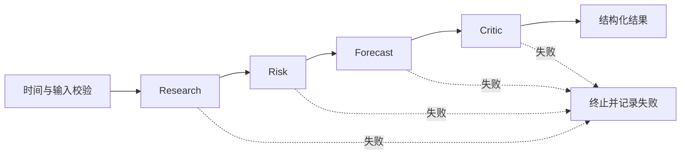

# LangGraph 编排接入

编排层采用 LangGraph，角色执行仍使用项目的 `ForecastInput`、能力路由、输出校验及共享 PEFT 后端。`LangGraphRunner.run()` 与原有 `AgentRunner.run()` 参数和结果结构一致；`compile()` 返回本地可执行图，可通过 `stream(..., stream_mode="updates")` 观察节点进度。原串行运行器保留为回归参照。

实现采用官方 [StateGraph、节点及条件边接口](https://docs.langchain.com/oss/python/langgraph/graph-api)。安装固定的 `langgraph==1.2.11`，作为可选依赖，不影响仅使用标准库的数据处理与评估：

```bash
conda activate lab
python -m pip install -e '.[graph]'
PYTHONPATH=src python -m foretellmesh check-agent-workflow \
  --engine langgraph --workflow reviewed_forecast \
  --output runs/langgraph_workflow_check_next
```

此命令使用脚本响应检查编排，不加载模型，不产生模型能力结论。`--engine serial` 保持既有运行方式。

## 图与模型的分工



每个角色是实际图节点。`quant_research`、`quant_risk` 在角色节点前增加 `quant_tools` 确定性节点。已有八种工作流程均可使用 LangGraph；本次没有把 Quant 自动加入完整预测流程，也没有新训练 Forecast / Critic 适配器。

- **LangGraph**：维护每次任务的结构化状态，决定下一节点或失败终止，提供本地节点进度。
- **Agent 执行步骤**：构造相同的角色提示，验证字段、证据引用、观察时间和概率，最多按配置修复一次。图自身不另加自动重试。
- **LoRA 路由**：节点按能力选择适配器。Research 与 Risk 可共享 `research_tool_lora`；角色与 LoRA 不一一绑定。
- **共享 PEFT executor**：保持一个基座，每个请求只激活一个适配器，锁覆盖切换、推理和恢复。当前模型节点串行运行。
- **工具**：显式输入的确定性运算放在工具节点；结果与缺参状态传给后续角色。

`GraphInput` 只接受 `context: ForecastInput`；prepare 节点会重新验证类型和时间。标签不进入图状态或模型请求。Forecast 只看 Research / Risk 选取的证据并接收简要结果；Risk 与 Critic 可以重新查看原始事前证据。状态不累积完整聊天记录。

这是本地、无持久化的首版：尚未开启 checkpointer、跨进程恢复、节点缓存、并行 GPU 推理或在线检索。`stream` 的更新可能包含完整节点状态，不能把内部字段误当作自动脱敏的数据。来源真实性和历史规则审核继续由数据流程负责。

## 使用现有模型后端

```python
from foretellmesh.langgraph_runtime import LangGraphRunner

# agents 为 load_capabilities() 返回的配置；backend 使用同一 SharedPeftExecutor。
runner = LangGraphRunner(
    agents, backend,
    output_protocol="grounded_json_v3",
    response_transport="single_json_fence",
)
result = runner.run(
    forecast_input,
    workflow="reviewed_forecast",
    mode="capability",
    capability_scope={"research_tool_lora"},
)
```

这个范围让 Research / Risk 使用已加载的研究能力，Forecast / Critic 使用 Base。所需适配器未加载时直接失败，不退回其他模型。没有通过评估的 checkpoint 仍不设为默认。

## 验证

单元检查共 **263 项，262 项通过、1 项可选 GPU 测试跳过**。新增覆盖八种流程、能力范围、真实节点顺序、失败后的停止、修复上限、未来证据拒绝、标签隔离、证据选择、Critic 修正、编译后配置固定及多次调用状态隔离。`pip check` 没有发现损坏的依赖。

使用真实 LangGraph 对 **504 个归档任务、870 次模型调用**进行 CPU 重放：旧完整预测流程 120 个、本轮工具对照 384 个，生成请求、适配器选择、工具结果、修复及最终结构化结果均与串行归档一致。另有此前 1,832 个任务的原始响应解析与历史评分回归保持一致。

在 `lab` / RTX 3090 上再运行 **6 个工作流、12 次真实 Qwen3-8B 调用**：Base 与 v3 LoRA 分别执行 Quant→Research、Quant→Risk、Research→Risk→Forecast→Critic。样本固定选为归档中的首个对应任务，没有根据答案好坏筛选。全部请求、原始生成文本和校验结果均与此前串行运行逐条一致；GPU 生成结果又通过 CPU 图重放审核。

| 工作流 | Base 秒 / 峰值分配 GiB | v3 秒 / 峰值分配 GiB |
| --- | ---: | ---: |
| quant_research | 8.504 / 15.67 | 3.761 / 15.76 |
| quant_risk | 4.299 / 15.67 | 2.695 / 15.76 |
| reviewed_forecast | 17.144 / 15.66 | 16.888 / 15.65 |

这六个任务合计 53.29 秒，生成耗时 53.01 秒，峰值分配显存 **15.76 GiB**，基座仅加载一次，权重全部冻结。首个 Base 调用含首次生成初始化开销，单样本耗时不用于模型速度排名。

另用四角色脚本响应做 100 次 CPU 测量（排除两次预热）：原运行器中位数约 0.64 毫秒，LangGraph 约 4.70 毫秒，后者含每次建图和编译。该测试衡量编排开销，不是模型 token 速度或预测性能。

编排接入未改变默认 checkpoint、提示或 RL 状态。LangGraph 让流程显式、可检查，但本实验没有证明框架本身提升预测能力；工具效果另见 [Quant 对照](tool_assisted_diagnostic_v1.md)。

本地归档：`runs/qwen3_8b_langgraph_regression_v1` 保存冻结选择、配置、源码、GPU 原始输出与成本；`runs/langgraph_verification_v1` 保存测试、依赖版本、CPU 重放和审计。GPU 报告 SHA-256 为 `a4efbf4e92fd49c5cdca5c5930c3867aafb3fb4d9d2236d15bab3c684f8e5a51`。

可复现的真实推理检查：

```bash
conda activate lab
HF_HUB_OFFLINE=1 TRANSFORMERS_OFFLINE=1 PYTHONPATH=src \
python -m foretellmesh.langgraph_probe \
  --tool-run runs/qwen3_8b_tool_assisted_validation_v1 \
  --system-run runs/qwen3_8b_research_tool_three_arm_validation_v4 \
  --agent-config configs/capability_agents_v1.json \
  --training-run runs/qwen3_8b_research_tool_sft_r16_v3 \
  --bundle data/processed/research_tool_counterfactual_v3 \
  --model-manifest checkpoints/qwen3_8b_base_manifest.json \
  --output runs/qwen3_8b_langgraph_regression_next
```

运行前需上述完整源归档及相同基座/适配器。工具与图实验各自冻结源码，重新执行历史审计时使用对应的 `source_snapshot`。测到原始输出不一致时会记录 `mismatch` 并返回非零退出码，不自动改写预期结果。
