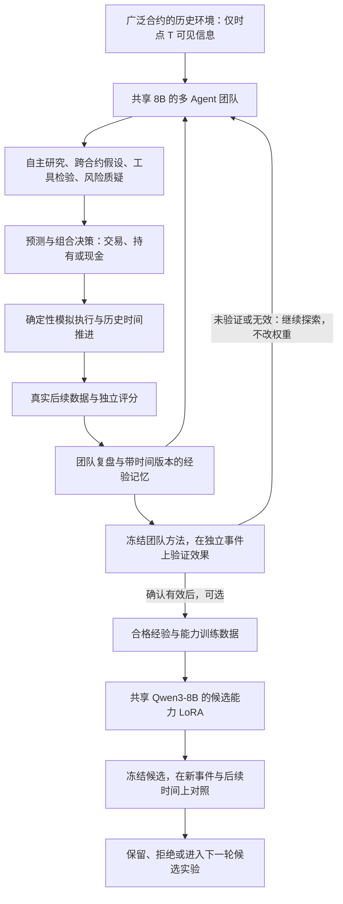

# 多 Agent 团队的递归自我改进

2026-09-20 用户确认 RSI 指 Recursive Self-Improvement。目标是让团队从大量真实预测市场历史中自主探索、模拟交易和复盘，形成可验证的经验数据，微调共享的 Qwen3-8B，再检验团队是否改善。

**最新规则：自主学习不等于每轮更新权重。先在冻结模型上探索、积累经验、改进团队方法，并在独立事件上验证有效；微调是通过验证后可选的经验固化步骤。** 已完成的小规模参数实验未满足这一条件，见 [历史结果](team_rsi_cycle_v1.md)。当前入口只收集候选经验，不自动训练。

“有效”必须对应可追溯的团队发现或方法版本，在未用于发现的新事件和后续时间上，对比未改进团队；匹配证据、费用与风险约束，记录全部尝试。交易方法检查成本后收益和回撤，预测方法检查相关 proper scores、校准和覆盖，不能用自我评价、一次盈利或单项指标下降代替验证。标准、对照、时间/事件划分和尝试预算应在检验前冻结。已经评估过的开发事件不能反复充当新的独立验证。当前探索入口不宣称已完成这种资格验证。

## 学习闭环



此前的宏观试点由固定工作流分析少量合约，再训练外部小型配置策略，没有测试上述闭环。新路线不按人工行业分类决定哪些合约能够相互关联。模型可以提出关联、检索证据、调用工具检验、提出反例和修订方法。代码规定真实数据、历史可见性、账本、资源与评估边界，不预先规定正确交易规律。

复用 Research、Quant、Game Theory、Forecast、Risk/Critic，由编排器维护团队状态。允许团队决定查什么、检验什么、采用或否定什么假设。第一轮固定角色契约和工具集合，暂不同时搜索任意工作流、奖励函数与模型架构，以便判断参数更新是否有效。新增组合建议、研究任务和复盘接口仍需实现，固定四段发言不等于自主学习。

SPF 教师概率归档保留为辅助来源，专家概率答案不再是经验学习的普遍前置条件。工具可复算结果、真实结算标签和模拟执行反馈分别支持不同任务。

## 广泛历史环境

- 从全量目录建立跨合约时间查询，不再以 `macro_candidates.jsonl` 限定范围；不按事后盈利、最终成交量或获胜状态选市场。
- 成交、规则、当时可用文本、账户和记忆各自保留时间与来源。仅当时存在且数据可见的合约能被检索。当前快照的规则修改、关闭状态、最终价格和累计成交量不能回填历史。
- 资源有限时采用事前固定、可复现且与未来结果无关的采样，再由团队从时点可见候选中检索关系。不能把全部市场塞进一个上下文，也不能把合约数量等同于独立事件数量。
- 在训练事件上发现关系、拟合表示与构建检索器。已有验证、保留测试及关联事件不得用于经验生成或表示拟合，隐藏其标签不代表可以用于训练。
- 新数据按时间与关联事件冻结学习区、训练内部核验区和独立开发区。仍需处理语义重合，不能随机拆分相关合约。
- 模拟账户保持 100 美元、费用和风险约束，允许长期持有现金，主要决策尺度为数天至数周。研究刷新不自动成交。
- 隔离训练环境应允许尚未证明有效的候选进行模拟探索；这不授予正式策略资格。新增探索入口须显式标记、限制预算并保留失败，不能自动放宽默认信号准入或改写旧实验。

## 经验数据与筛选

每个 episode 保存数据/模型/工作流版本、事件身份、种子、时间、输入和检索结果哈希、原始角色输出、工具结果、预测、模拟订单和成交、失败、反馈可用时间、记忆版本、复盘及核验结论。以下为完整目标契约；首版字段映射和覆盖以 `team_learning.py` 与实测报告为准：

| 部分 | 内容及用途 |
| --- | --- |
| `decision_context` | T 时点证据、历史行情、账户与已有记忆；所有来源可用时间 ≤ T |
| `team_trace` | 原始角色结果、工具结果、候选与最终决策，保留生成延迟 |
| `external_feedback` | 真实结果、工具核验、费用账本和评分；到可用时间才开放 |
| `retrospective_context` | 原始记录与已发生反馈；单独的事后复盘任务输入 |
| `reflection` | 错误诊断、关系假设、改进建议；模型生成候选，须核验 |
| `admission` | 训练用途、验证方法、拒绝原因、分区与哈希 |

不同反馈不能混成一个正确答案：

1. 工具、计算、证据和时点处理使用通过核验的请求/回答对训练；JSON 有效不等于判断正确。
2. 事件概率用真实结果和 proper scoring 评价；结算 0/1 不改写为事前应报 0%/100%，不只挑押中样本充当校准教师。
3. 组合行动用带执行条件的成本后反馈；盈利不证明每个角色或每句话正确，预测与配置评分分别保存。
4. 复盘可看到已发生反馈，但属于独立任务。经验只能影响后续学习时点，不能把看过答案的解释伪装为原始事前监督。
5. 保留亏损、现金持有、被证伪假设和工具失败。失败动作不直接作为 SFT 正例；只有可靠可比反馈才能形成后续偏好任务。

同一 8B 的 Critic 可以提议改进，不能独自担任真值裁判。独立冻结评分器核验时间、计算、标签和账本；经验规律在训练内部未参与生成的后续事件上核验。记录全部尝试并限制搜索预算，不只报告碰巧成功的尝试。

## 参数更新是否有效

默认循环是冻结权重的团队探索 → 复盘与方法改进 → 冻结候选方法 → 独立对照验证。没有确认有效就继续探索或拒绝候选，不启动微调。确认团队发现可复现的效果后，才单独考虑能力 LoRA 固化；训练完成还要验证是否保留或增强原有效果。历史首轮直接训练的流程已经退出当前运行入口，不是新的默认循环。

只有经过上述效果验证、确实决定进行参数实验后，才使用以下四组对照；日常探索无需执行微调组：

| 权重 | 不提供学习期经验记忆 | 提供相同冻结学习期经验记忆 |
| --- | --- | --- |
| 原始 Base | A：原始团队 | B：仅记忆学习 |
| 经验微调候选 | C：参数更新 | D：参数更新 + 同一记忆 |

B−A 检验记忆效果，C−A 和 D−B 帮助区分参数贡献。另保留现金、固定规则和同期市场概率对照。评估期不更新权重、提示、记忆或检索表示，也不把评估反馈灌回训练。在线适应如需研究，另冻结反馈可见性协议。

仍共享 Qwen3-8B，以能力 LoRA 微调，第一轮只改变一个能力适配器，不为每个角色训练完整模型。先获得核验经验，再根据实际 token 长度和显存预检决定 BF16 LoRA 或 4-bit QLoRA。

报告成本后净权益、回撤、交易数、持有时间、费用、覆盖率，以及 Brier、Log Loss、ECE、工具/格式有效率、延迟与显存。按独立事件与时间段呈现结果，不把单笔幸运盈利或训练损失下降认定为进步。最终测试封存，首轮开发比较不自动替换默认模型。

时间过滤只能约束显式输入，不能消除基座预训练中的历史记忆污染；配对比较仍需披露这个限制，并保留后续前瞻留档检验。

## 现有接口与缺口

| 模块 | 当前能力 | 需要补齐 |
| --- | --- | --- |
| `agent_runtime.py` / `langgraph_runtime.py` | 共用 8B 的角色编排与校验 | 自主研究任务、跨合约工具、经验与复盘状态 |
| `trading_agent_signals.py` | 固定 Base 信号、延迟与调用记录 | 探索 episode；现有贪心生成且禁止训练的协议不是 RSI |
| `pma_catalog.py` / 历史价格库 | 全量目录，宏观候选价格重建 | 不依赖宏观关键词的时间查询与事件隔离 |
| `event_allocation.py` | 天至周持仓、成本与风险约束 | 隔离的团队探索接口与反馈归因 |
| `capability_training.py` | 研究/工具 BF16 LoRA 训练 | 经验数据准入和导入，不能直接传入任意 episode |
| `sft_data.py` | 教师目标与来源校验 | 区分经验、复盘、结果监督和概率教师 |

历史 episode、反馈、候选导出和一次参数实验已实现；当前优先补足跨合约检索覆盖、非空且可检验的复盘，以及独立的方法效果验证。全量扫描、经验生成、GPU 微调和四组评估须分别记录完成状态。不能继续用补充宏观专家答案或更换 PPO 代替此目标。

## 方法参考

[Reflexion](https://arxiv.org/abs/2303.11366)研究利用反馈和语言记忆改进 Agent 行为；[STaR](https://arxiv.org/abs/2203.14465)研究生成、筛选训练内容并迭代微调。它们可作为设计参考，不构成预测市场盈利证据。这里不照搬知道正确答案后补理由的过程来制造事前预测监督。

## 当前运行入口

```bash
PYTHONPATH=src python -m foretellmesh.team_rsi_experiment run \
  --config configs/team_exploration_v1.json \
  --model-manifest runs/qwen3_8b_team_learning_interface_smoke_v1/model_manifest.json \
  --output runs/qwen3_8b_team_exploration_next
```

该入口只读取学习分区，冻结全部权重，保存原始 episode、候选经验和未验证的经验产物。输出明确记录 `fine_tuning_triggered=false`、`effectiveness_verified=false`、`admitted_training_examples=0`。旧自动微调配置会在加载数据和模型前被拒绝。当前配置使用既有学习样本，不能把重复收集当作新的独立验证。旧实验的离线审计仍使用各自冻结源码，不修改历史产物。

当前新增的自主检索、可检验研究记录和连续 $100 → $110 模拟目标见 [冻结团队探索](team_discovery_v1.md)。达到累计 10% 只是产品阶段目标，不能代替独立效果验证或自动触发微调。
